*From Factor Analysis to Structural Equation Modelling*
=======================================================

Part a. Factor Analysis
-----------------------

**Purpose:** Investigate the 15-item index of human personal values to extract the appropriate number of factors.

The data set was assessed for whether factor analysis was appropriate. The Kaiser-Meyer-Olkin of 0.876 was in the 'meritorious' range (0.8 to 0.9) and indicated that relationships between pairs of items could be explained by other variables (i.e. factor analysis was possible). Bartlett's Test of Sphericity was significant, *X*<sup>2</sup>(105, N =371) = 2013.13, p \<.001, meaning that there was sufficient correlation between the items for factor analysis. Eigenvalues were calculated to assess the variance explained and determine the most suitable number of factors for extraction (Table 1).

Table 1. *Eigenvalues and percent variance explained (N=371)*

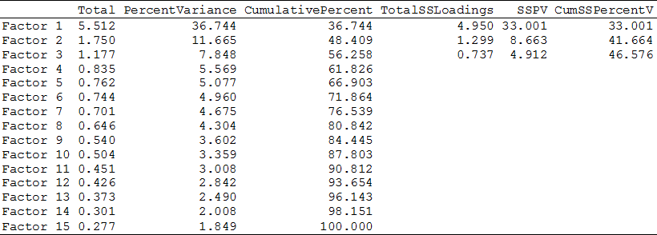

The table above shows three factors with Eigenvalues \> 1, indicating that the factor analysis should start with a three factor solution. Further to this analysis a scree plot was produced (Figure 1).

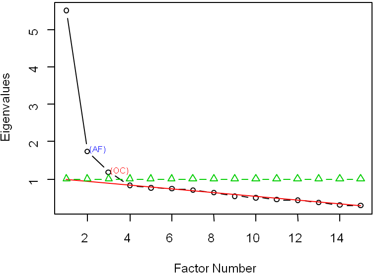

*Figure 1.* Scree plot of 15 item values measure (with Optimal Coordinates = 3 factors)

The Figure 1 scree plot represents the Eigenvalues of Table 1 in graphical form. It supported the prior analysis and indicates a three factor extraction. Exploratory factor analysis was carried out on the test score using Maximum Likelihood Estimation (MLE) and Direct Oblimin rotation. The rotated solution loadings are shown below.

Table 2. *Pattern matrix: Exploratory Factor Analysis (\<0.2 suppressed)*

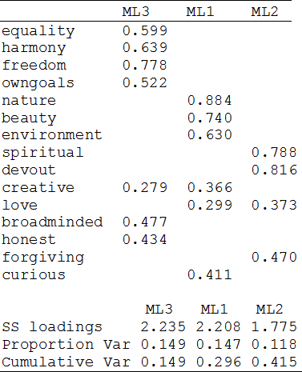

In initial extraction and rotation only two items, 'creative' and 'love', loaded higher than 0.2 on more than one factor. The rotation and factor loadings could be improved be removing items that explain less variance or load onto multiple factors.

Part b. Improving the Factor Solution
-------------------------------------

To improve the solution changes were made iteratively and each model was added to Table 3 below. Model 1 is the starting model from above. For Model 2, communalities were examined and items loading below 0.3 (i.e. had little in common with the factors) were removed ('curious'=0.267; 'honest'=0.288). Remaining items had sufficient communalities to remain in the analysis (*R*<sup>2</sup>\>0.3). This decreased the Chi-square and Root Mean Square Error of Approximation (RMSEA), which indicated an improved model.

Model 2 was used to assess extraction methods. This included Minimum Residual, Weighted Least Squares, Generalized Weighted Least Squares, Principal Factor Solution (PA) and MLE. Results for each method were indistinguishable so the results of the PA were tabled for comparison as Model 3 and MLE was retained as the extraction method.

A two-factor (Model 4) and a four-factor (Model 5) extraction was attempted. The two factor solution performed poorly on all statistics, while the four factor solution improved the Chi-square and RMSEA. However, the fourth factor on Model 5 had only two items, which loaded on other factors, and a low *R*<sup>2</sup> of 0.40 (not tabled). Although adding a fourth factor decreased Chi-square, the items do not load exclusively indicating. Model fit statistics provide misleading feedback on the superfluous fourth factor. Model 2 was retained and used to assess different rotations.

Rotations were compared in SPSS and R to determine which produced the simplest pattern matrix. Many rotations overloaded the first factor (i.e. varimax, quartimax, bentlerT, geominT, simplimax, biquartimin, bifactor). The remaining rotations (i.e. oblimin, promax, bentlerQ, geominQ, cluster) produced similar patterns so the better known rotations, oblimin and promax (which are similar mathematically), were compared as further items loading on multiple factors were removed.

Removing items 'creative' and 'love' simplified the factor loadings. Oblimin (Model 6) almost produced a simple rotation and promax (Model 7) did achieve a simple solution. Promax also outperformed oblimin in terms of higher *R*<sup>2</sup> for each factor, and higher loadings for each item on each relevant factor. Subsequent model alterations are made to Model 7.

Finally, to achieve a non-significant Chi-square an additional item was removed. Both 'owngoals' and 'forgiving' had low loadings on relevant factors. Removing 'forgiving' would leave two items in the relevant factor. Removing 'owngoals' would leave four items, in addition to being the item that double-loaded in the prior Model 6 oblimin rotation. Removing 'owngoals' produced a non-significant Chi-square of, *X*<sup>2</sup>(18, N=371)=26.93, p=0.08, meaning that there was no significant difference between the expected and observed covariance matrices (i.e. small residuals). All models are presented below (Table 3).

Table 3. *Factor Models (EM=Extraction Method; F=Factor Number; Sim=Simple Loadings Y/N; F\#R2=Factor* *R*<sup>2</sup>

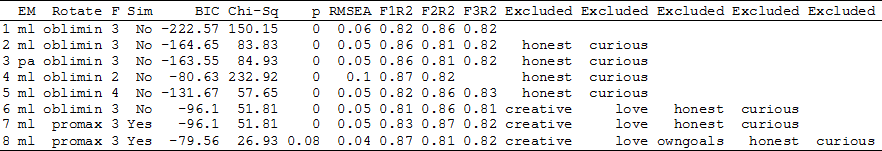

The above table shows all relevant statistics and methods trialled in producing the final factor model. Below is the pattern matrix of the final model.

Table 4. *Pattern matrix: Exploratory Factor Analysis (\<0.2 suppressed)*

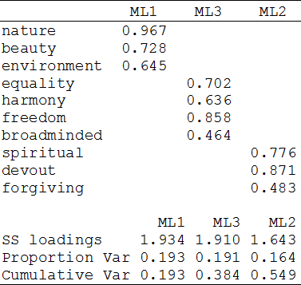

The Pattern matrix above shows all remaining items loading strongly on three factors. The rotation achieved simplicity with no item loading greater than 0.2 on one factor. The factor correlation matrix is show below.

Table 5. *Factor Correlations matrix*

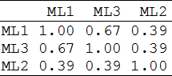

In summary, items 'curious' and 'honest' were removed for low communalities, 'creative' and 'love' for loading well on two factors, and 'own goals' to produce a non-significant Chi-square. The best solution used the remaining 10 items, distributed over three factors, extracted with MLE followed by a promax rotation. The final multiple *R*<sup>2</sup> between the factors (ML1; 2; 3) and factor score estimates was equal to 0.873, 0.813 and 0.822 meaning that variance explained by the factors was 87.3%, 81.3% and 82.2% for factors one, two and three respectively. The non-significant Chi-square, *X*<sup>2</sup>(18, *N*=371)=26.931, *p*=0.08, meant that there is no significant difference between the expected and observed covariance matrices.

Part c. AMOS
------------

The above solution was entered into AMOS (Figure 2) as the initial model. In order to give the latent variables a scale they were standardised (i.e. were fixed at 1).

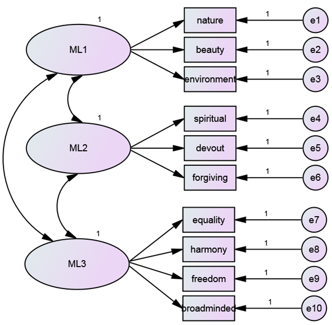

*Figure 2.* Initial Model

The analysis was run and the Chi-square for the model was significant *X*<sup>2</sup>(32, *N*=371)=99.289, *p*\<.000, which meant that the model fit could be improved. Statistics for each model were recorded in Table 6 and identified problems were recorded in Table 7.

Firstly, outliers can compromise the model fit, so the top three outliers as identified by Mahalanobis *d*-squared were removed (cases 303, 262, 10). This improved model fit.

The estimates and critical values were assessed to determine any immediate model changes required. All factor loadings (i.e. regression weights) were significant and contributed to the appropriate factors. All standardised factor loadings were greater than 0.5 and therefore contributed sufficiently to the measurement of their respective constructs. All critical ratios for error variances were significant (excluding the factors with variances fixed to 1), and all thee factor covariances were significant, therefore contributing to the model. No changes to the model were apparent at this stage.

As expected, the squared multiple correlations (SMCs) resembled the communalities first used in *Part b* to remove items contributing below 0.3. Some items had low communalities and as such had low SMCs in the AMOS analysis. The item 'broadminded' came from the four-item factor and had a loading of 0.335. Removing it improved the Chi-square (see Table 6). The removal of this item did not bring the model to non-significance at this stage so it was left in the model as a potential re-specification later on. Future models include 'broadminded' until removal is indicated.

Running the model without 'broadminded' produced useful results in terms of the modification indices and standardised residuals covariances (SRCs). The largest SRC was between 'freedom' and 'devout' in the initial model. Removing 'broadminded' increased both the SRC and the 'freedom' to 'devout' score in the modification indices (ML3 to 'devout' is the largest).

The model was tested with items 'freedom' and 'devout' removed. Removing 'devout' left MLE2 with only two items but produced the best fit so far. This was expected given the large SRCs for that item. The remaining two items with high SRCs that had not yet been investigated were 'environment' and 'spiritual'. Removing 'environment' produced an average model not superior to previous specifications. Removing 'spiritual' produced the best model solution found so far.

One possible explanation for the influence of 'spiritual' is that it has the highest SMC of all items, accounting for 73.6% of the variability in the factor for the initial model, as compared to the other two items in the factor which have much lower SMCs ('devout'=52.1%; 'forgiving'=33.1%). Although the three items were matched in the exploratory factor analysis, within a structural equation model the item 'spiritual' may be measuring a different latent variable from the other two items in the factor. Despite being a good item (i.e. high SMC), 'spiritual' may have been the only item measuring an unknown latent variable. This new solution has one non-significant variance for a measurement error term (on 'forgiving') but all paths are significant. The highest SRCs in this new model were for 'broadminded'. This item was identified before as contributing the least to the third factor. This factor still had four items and one could be removed to produce an optimal solution, so both 'broadminded' and 'spiritual' were dropped from the model. This reduced Chi-square to non-significance, *X*<sup>2</sup>(17, *N*=368)=25.511, *p*=.084, and output a useable solution. Results are shown in Table 6 below.

Table 6. *Fit Statistics*

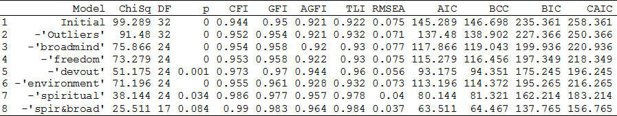

The above table shows the gradual improvements in model fit. These models are the data set without outliers and with one item removed. The best and final model has two items removed; One which was not contributing (i.e. low SMC), and one which was potentially measuring an unknown latent variable (i.e. abnormally high SMC compared to other items in factor).

The final model fit without 'spiritual' and 'broadminded' was the best specified. RMSEA was below 0.05 with a non-significant PCLOSE supporting the 'close fit' hypothesis. The SRCs were lower but still of concern for item 'devout'. The GFI, AGFI and TIL were all greater than 0.95 and higher than any other solution, while the AIC, BCC, BIC and CAIC were lower than any other solution. The problems identified at each stage of model re-specification are tabled below.

Table 7. *Identified Problems*

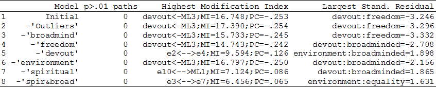

The above table indicates how many models failed to properly fit 'devout'. The modification indices helped diagnose problems and suggested re-specifications. However, a review of the SMCs was necessary to determine why the model predicted 'devout' so poorly. It was not evident from the indices that the low contributor 'devout' may have been improperly paired with the strong contributor 'spiritual', which was potentially measuring an unknown latent factor (i.e. poor construct validity).

The main shortcoming of this model is that it reduces the second factor to two items only. This may compromise how well that factor is measured. A researcher using these items should consider dropping the factor and items entirely. At the least, they should write new items that focus better on that factor, and consider dropped item 'devout' which caused problems in model specification.

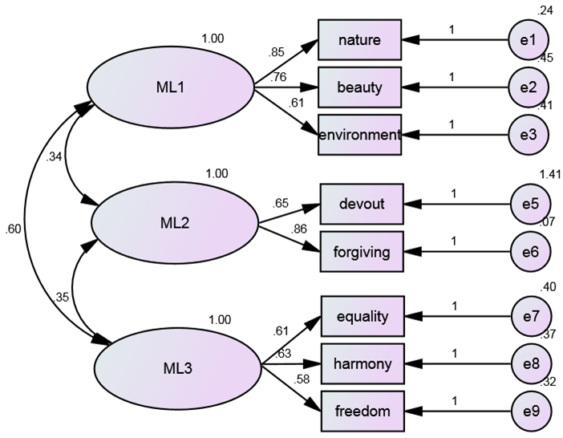

Figure 3. *Final Model*

Part d. Discriminant Validity
-----------------------------

For two factors to have discriminant validity means that the indicators of those factors are sufficiently different such that they measure two separate constructs. An oblique rotation in the EFA produced the best factor extraction. This meant that the factors were permitted to correlate (i.e. interrelated constructs) and therefore it was important to test discriminant validity for this model.

Using Bagozzi's method, the model was run unconstrained and output *X*<sup>2</sup>(17, *N*=368)=25.511, *p*=.084, as above. The paths between factors were constrained to '1' for each factor correlation over three models, and opened to previously determined loadings in an Unconstrained model for the purposes of comparison. Results were tabled below.

Table 8. *Constrained model tests for discriminant validity*

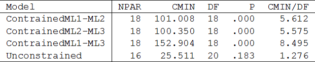

For the smallest Chi-square the difference is still *X*<sup>2</sup>=74.839 points. This supports to the *p*\>.001 (df=2) level that constraining the correlation between each factor significantly worsened the model. From this is can be concluded that discriminant validity was upheld for all three factors.

Part e. Adding Theory to Factors
--------------------------------

ML1 included 'nature', 'beauty' and 'environment' ('How important is unity with nature to you?'; 'How important is a world of beauty to you?'; 'How important is protecting the environment to you?'). This factor was named 'Environmental Concern' due to the environmentalist themes in the items. People who score highly would hold environmentalist values (i.e. being 'green'), be interested in environmental issues, or live in rural areas by choice and livelihood.

ML2 included 'devout' and 'forgiving' ('How important is being devout to you'; 'How important is being forgiving to you'). Given the religious themes of these two items this factor could be named 'Religious Observance'. The factor is not 'Religiosity' because the vernacular used, 'devout' and 'forgiving', refers to more orthodox and formal religious constructs, particularly religions that hold forgiveness as part of explicit devotional ceremonies. This may be why the model fit improved so much when item 'spiritual' was removed from this factor. The question 'How important is a spiritual life to you?' mixes in themes of lifestyle choices in addition to targeting less tangible, more metaphysical ('spiritual') religious concepts. People who score highly on 'Religious Observance' would attend a religious establishment (e.g. Church) and participate in a religion favouring those two concepts of forgiveness and devotion.

ML3 included 'equality', 'harmony' and 'freedom' ('How important is equality to you?'; 'How important is inner harmony to you?'; 'How important is freedom to you?'). The items in this factor do not clearly point out one construct. There are themes of egalitarianism, mental health and individualism (or voluntaryism). Each item could itself be part of a construct. If they were combined the factor could be described as 'Idealism' or 'Peaceful Universe', in reference to the abstract concepts used in the items. The title 'Peaceful Environment' would have been easier to understand but the construct would have been confused with ML1 'Environmental Concern'. People who score highly would have a value orientation focussing on minimising causes of disruption or friction in society (e.g. inequality) and optimising general well-being (e.g. inner harmony, freedom).

As a further explanation, voter stereotypes may fit the value orientations of the hypothetical people described for the factors above. For example, people scoring highly on ML1 'Environmental Concern' might be likely to vote Greens. People scoring highly on ML2 'Religious Observance' could vote for a religious party, such a Family First. Finally, people scoring highly on ML3 'Idealism'/'Peaceful universe', which mixes freedom with egalitarianism, may vote National.

Part f. Second Order Constructs
-------------------------------

Discriminant validity was upheld for all factors and as such a second order construct was not necessary. If a researcher wanted to create the new variable for theoretical purposes then the highest correlation was between ML1 and ML3 ('Environmental Concern' to 'Idealism'/'Peaceful Universe'; *r*=0.597). This is most likely due to overlap in the constructs (e.g. beauty, unity, harmony, equality, freedom). The new latent variable could be place above ML1 and ML3 with a covariance to ML2. This path specification will fit a functional modal, identical Chi-square, *X*<sup>2</sup>(17, *N*=368)=25.511, and identical fit statistics. The second-order model is plotted below.

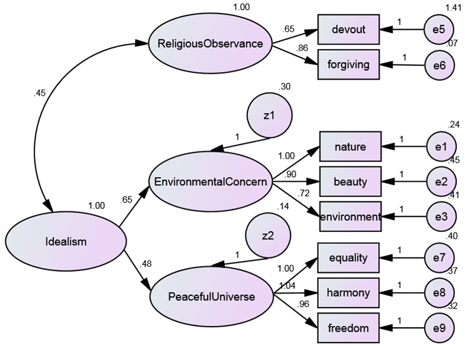

*Figure 4.* Second-Order CFA

As noted, the second order construct is not required statistically. However, it would be useful for theory formulation. For instance, the new latent variable could assume the name 'Idealism', which was the alternative title for ML3. This model suggests that both 'Environmental Concern' and 'Peaceful Universe' operate underneath a broader personal value of 'Idealism'. This is a suitable second order factor because a level of idealism (i.e. valuing and acting on principles) would be a necessary precursor to scoring highly on either ML1 or ML3.

Part g. Summated Scales
-----------------------

The variables 'goodhealth' and 'Future' had missing values (NAs). For 'Future', the number of NAs represented almost one third of the dataset (NAs=106). How this was managed may influence the analysis so two separate correlation tables were produced. The first table included only complete cases with case/row-wise deletion of non-complete cases. The second table included all cases with missing values replaced by mean values.

Table 9. *Summated Scale Correlations (Casewise NA deletion, N=259),* \*\*\* *p\<.001,* \*\* *p\<.01,* \* *p\<.05.*

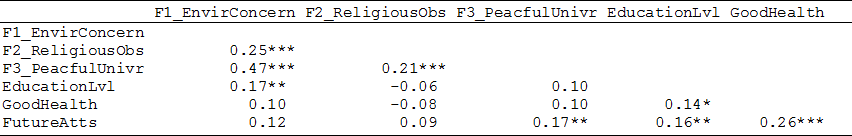

Table 10. *Summated Scale Correlations (Mean NA replacement, N=368),* \*\*\* *p\<.001,* \*\* *p\<.01,* \* *p\<.05.*

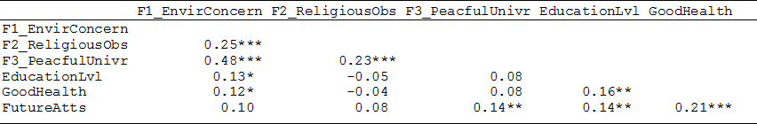

There were minor differences between the two correlation tables. This indicates that there was no serious systematic bias in the dataset caused by the missing cases. Only one correlation, between 'Environmental Concern' and 'Good Health', went from non-significance to significance. Conservatively, non-significance should be assumed for this weak correlation.

The strongest relationships were between the factors. This reflected the strength and direction of factor correlations produced by the path model. The small but significant positive correlation between 'Education Level' and 'Environmental Concern' suggested that people who hold environmentalist guiding values are likely to have a higher level of education. The small but significant positive correlation between 'Future Attitudes' and 'Peaceful Universe' suggested that people who think and have attitudes about the future are likely to maintain 'Peaceful Universe' values. If the 'Good Health' correlation is accurate, rather than an artefact of the mean replacement, then it would suggest that people who are healthy are likely to maintain environmentalist guiding values.

Part h. Testing Scales for Sex Differences
------------------------------------------

All three summated scales had significant scores, at the *p*\>.001 level, on the Shapiro-Wilk test of normality and the Lilliefors-Kolmogorov-Smirnov test for normality. Since normality was not assumed, three Independent 2-group Mann-Whitney U Tests (i.e. non-parametric) were carried out. After the *p*-value bonferroni correction for three tests there was no significant difference between males and females for factor 'Environmental Concern', *W*(366)= 13112.5, *p*=0.079. There was a significant differences for factor 'Religious Observance', *W*(366)= 12164, *p*=0.004, on which females scored higher (Females, *M*=6.65, *SD*=1.98; Males, *M*=5.95, *SD*=1.80). There was a significant difference for factor 'Peaceful Universe', *W*(366)= 12591, *p*=0.016, on which females also scored higher (Females, *M*=13.01, *SD*=1.95; Males, *M*=12.3, *SD*=2.30).

This would support a research theory that females hold observable religious activity and 'Peaceful Universe' value as guiding principles in their lives to a greater extent than males do. Note however the mean differences were small, that the significance may be a product of the large sample and small standard deviations, and that significance alone does not determine whether differences are meaningful.

Appendix. R Code
================

``` r
#Part a.

#Input data
library(foreign)
dir <- 'E:/SEMdata/Value.sav'
x <- read.spss(dir, use.value.labels = FALSE, to.data.frame = TRUE, max.value.labels = Inf,
trim.factor.names = FALSE, trim_values = TRUE, use.missings = TRUE)
x <- x[,1:15]

#KMO & BTS:
library(rela)
base <- paf(as.matrix(x), eigcrit=1, convcrit=.001)
KMO <- paste('Kaiser-Meyer-Olkin Measure of Sampling Adequacy =', round(as.numeric(base[5]),3))
df <- (dim(x)[2]^2-dim(x)[2])/2
Bartlett <-  paste('Bartlett's Test of Sphericity =', round(as.numeric(base[7]),3),
', df =', df,', Sig.p =', pchisq(as.numeric(base[7]), lower.tail=FALSE, df), sep=' ')
KMO;Bartlett

#Total Variance Explained Table (Eigen Values)
ls <- factanal(x, factors=3, rotation='none')$loadings
Total <- eigen(cor(x))$values
PercentVariance <- 100*Total/sum(Total)
CumulativePercent <- 100*cumsum(Total/sum(Total))
TotalSSLoadings <- as.numeric(c(sum(ls[,1]^2), sum(ls[,2]^2), sum(ls[,3]^2),rep('NA',12)))
SSPV <- as.numeric(c(100*sum(ls[,1]^2)/length(Total), 100*sum(ls[,2]^2)/length(Total),
100*sum(ls[,3]^2)/length(Total),rep('NA',12)))
CumSSPercentV <- c(SSPV[1], sum(SSPV[1:2]), sum(SSPV[1:3]),rep(NA,12))
TVAtable <- cbind(Total,PercentVariance,CumulativePercent,TotalSSLoadings,SSPV,CumSSPercentV )
rownames(TVAtable) <- paste('Factor', 1:length(Total))
TVAtable <- round(TVAtable,3)
print('Total Variance Explained'); print(TVAtable, na.print='')

#Scree Plot
library(nFactors)
nScree(x)
par(oma=c(0,0,0,0),font.lab=6); plotnScree(nScree(x), main='', legend=T, xlab='Factor Number')

#Pattern Matrix
library(psych)
Q1a_model1 <- fa(x, nfactors=3, n.iter=1, rotate='oblimin', residuals=TRUE, SMC=TRUE, fm='ml')
print(Q1a_model1$loadings, digits=3, cutoff=.2, sort=TRUE)


#______________________________________________________________________
#Part b.

#Removing low-Comm vars
Communalities <- 1-Q1a_model1$uniquenesses
data.frame(round(Communalities,4)[order(Communalities)])

z <- x[,names(x)!='honest' &
names(x)!='curious']
Q1b_model1 <- fa(z, nfactors=3, n.iter=1, rotate='oblimin', residuals=TRUE, SMC=TRUE, fm='ml')
Communalities <- 1-Q1b_model1$uniquenesses
data.frame(round(Communalities,4)[order(Communalities)])

#Extraction Methods
i <- 'minres'
for(i in c('minres', 'wls', 'gls', 'pa', 'ml')) {
p <- fa(z, nfactors=3, n.iter=1, rotate='oblimin', residuals=TRUE,SMC=TRUE, min.err=0.001,
max.iter=50, warnings=TRUE,fm=i,alpha=.1,p=.05,oblique.scores=FALSE)
print(c(p$rotation,p$fm));print(c(p$STATISTIC,p$RMSEA[1],p$BIC, p$*R*^2^),digits=3)
print(p$loadings, digits=3, cutoff=.2, sort=TRUE)
}
Q1b_model2 <- fa(z, nfactors=3, n.iter=1, rotate='oblimin', residuals=TRUE, SMC=TRUE, fm='pa')

#Factor Number
i <- 1
for(i in c(2,4)) {
p <- fa(z, nfactors=i, n.iter=1, rotate='oblimin', residuals=TRUE,SMC=TRUE, min.err=0.001,
max.iter=50, warnings=TRUE,fm='ml',alpha=.1,p=.05,oblique.scores=FALSE)
print(c(p$rotation,p$fm));print(c(p$STATISTIC,p$RMSEA[1],p$BIC, p$*R*^2^),digits=3)
print(p$loadings, digits=3, cutoff=.2, sort=TRUE)
}
Q1b_model3 <- fa(z, nfactors=2, n.iter=1, rotate='oblimin', residuals=TRUE, SMC=TRUE, fm='ml')
Q1b_model4 <- fa(z, nfactors=4, n.iter=1, rotate='oblimin', residuals=TRUE, SMC=TRUE, fm='ml')

#Rotation
i<- 'none'
for(i in c('none', 'varimax', 'quartimax', 'bentlerT', 'geominT','promax', 'oblimin', 'simplimax', 
'bentlerQ', 'geominQ', 'biquartimin','cluster', 'bifactor')) {
p <- fa(z, nfactors=3, n.iter=1, rotate=i, scores='regression', residuals=TRUE,
SMC=TRUE, min.err=0.001, max.iter=50, warnings=TRUE, fm='ml',alpha=.1,p=.05,oblique.scores=FALSE)
print(p$rotation);print(p$loadings, digits=3, cutoff=.2, sort=TRUE)
}

z <- x[,names(x)!='honest' & names(x)!='curious' & names(x)!='creative' & names(x)!='love']
Q1b_model5 <- fa(z, nfactors=3, n.iter=1, rotate='oblimin', residuals=TRUE, SMC=TRUE, fm='ml')
Q1b_model6 <- fa(z, nfactors=3, n.iter=1, rotate='promax', residuals=TRUE, SMC=TRUE, fm='ml')
print(Q1b_model5$loadings, digits=3, cutoff=.2, sort=TRUE)
print(Q1b_model6$loadings, digits=3, cutoff=.2, sort=TRUE)

#Final Chi-Square Optimize
z <- x[,names(x)!='honest' & names(x)!='curious' & names(x)!='creative' & names(x)!='love'
 & names(x)!='owngoals' ]
Q1b_model7 <- fa(z, nfactors=3, n.iter=1, rotate='promax', scores='regression', residuals=TRUE,
SMC=TRUE, min.err=0.001, max.iter=50, warnings=TRUE, fm='ml',alpha=.1,p=.05,oblique.scores=FALSE)
print(Q1b_model7$loadings, digits=3, cutoff=.2, sort=TRUE)


#Model comparison
m <- Q1a_model1
t1 <- cbind(m$fm,m$rotation,m$factors,'No',rbind(round(c(m$BIC,m$STATISTIC,m$PVAL,m$RMSEA[1],m$*R*^2^[1:3]),2)),
rbind(setdiff(names(x),names(m$weights[,1]))),rbind(rep(NA,5)))
m <- Q1b_model1
t2 <- cbind(m$fm,m$rotation,m$factors,'No',rbind(round(c(m$BIC,m$STATISTIC,m$PVAL,m$RMSEA[1],m$*R*^2^[1:3]),2)),
rbind(setdiff(names(x),names(m$weights[,1]))))
m <- Q1b_model2
t3 <- cbind(m$fm,m$rotation,m$factors,'No',rbind(round(c(m$BIC,m$STATISTIC,m$PVAL,m$RMSEA[1],m$*R*^2^[1:3]),2)),
rbind(setdiff(names(x),names(m$weights[,1]))))
m <- Q1b_model3
t4 <- cbind(m$fm,m$rotation,m$factors,'No',rbind(round(c(m$BIC,m$STATISTIC,m$PVAL,m$RMSEA[1],m$*R*^2^[1:3]),2)),
rbind(setdiff(names(x),names(m$weights[,1]))))
m <- Q1b_model4
t5 <- cbind(m$fm,m$rotation,m$factors,'No',rbind(round(c(m$BIC,m$STATISTIC,m$PVAL,m$RMSEA[1],m$*R*^2^[1:3]),2)),
rbind(setdiff(names(x),names(m$weights[,1]))))
m <- Q1b_model5
t6 <- cbind(m$fm,m$rotation,m$factors,'No',rbind(round(c(m$BIC,m$STATISTIC,m$PVAL,m$RMSEA[1],m$*R*^2^[1:3]),2)),
rbind(setdiff(names(x),names(m$weights[,1]))))
m <- Q1b_model6
t7 <- cbind(m$fm,m$rotation,m$factors,'Yes',rbind(round(c(m$BIC,m$STATISTIC,m$PVAL,m$RMSEA[1],m$*R*^2^[1:3]),2)),
rbind(setdiff(names(x),names(m$weights[,1]))))
m <- Q1b_model7
t8 <- cbind(m$fm,m$rotation,m$factors,'Yes',rbind(round(c(m$BIC,m$STATISTIC,m$PVAL,m$RMSEA[1],m$*R*^2^[1:3]),2)),
rbind(setdiff(names(x),names(m$weights[,1]))))
ModelComparison <- t1
for(i in list(t2,t3,t4,t5,t6,t7,t8)) { 
ModelComparison <- merge(ModelComparison,i,all.x=T,all.y=T, sort=F)
}
names(ModelComparison) <- c('EM','Rotate','F','Sim','BIC','Chi-Sq','p','RMSEA','F1*R*^2^','F2*R*^2^','F3*R*^2^',
rep('Excluded',5))
print(ModelComparison, na.print='')

#Final Model Pattern matrix
print('Pattern Matrix');print(Q1b_model7$loadings, digits=3, cutoff=.2, sort=TRUE)
print('Factor Correlation Matrix');round(Q1b_model7$Phi,3)
print('Variance Explained'); round(100*Q1b_model7$*R*^2^,1)
print('Chi-Square'); Q1b_model7$STATISTIC; print('p');Q1b_model7$PVAL

#______________________________________________________________________
#Part c.
#AMOS used for analysis, R for tables

#Table 6modelchi  df p CFI GFI AGFITLI  RMSEA AIC BCC   BIC CAIC
Q2c1 <- cbind('Initial', 99.289, 32, .000, .944, .950, .921, .922, .075, 145.289, 146.698, 235.361, 258.361)
Q2*X*^2^ <- cbind('-'Outliers'',91.480, 32, .000, .952, .954, .921, .932, .071, 137.480, 138.902, 227.366, 250.366)
Q2c3 <- cbind('-'broadmind'', 75.866, 24, .000, .954, .958, .920, .930, .077, 117.866, 119.043, 199.936, 220.936)
Q2c4 <- cbind('-'freedom'',73.279, 24, .000, .953, .958, .922, .930, .075, 115.279, 116.456, 197.349, 218.349)
Q2c5 <- cbind('-'devout'',51.175, 24, .001, .973, .970, .944, .960, .056, 93.175,  94.351,  175.245, 196.245)
Q2c6 <- cbind('-'environment'',71.196,24, .000, .955, .961, .928, .932, .073, 113.196, 114.372, 195.265, 216.265)
Q2c7 <- cbind('-'spiritual'',38.144, 24, .034, .986, .977, .957, .978, .040, 80.144,  81.321,  162.214, 183.214)
Q2c8 <- cbind('-'spir&broad'',25.511, 17, 0.084,.990, .983, .964, .984, .037, 63.511,  64.467,  137.765, 156.765)

ModelComparison <- Q2c1
for(i in list(Q2c1,Q2*X*^2^,Q2c3,Q2c4,Q2c5,Q2c6,Q2c7,Q2c8)) { 
ModelComparison <- merge(ModelComparison,i,all.x=T,all.y=T, sort=F)
}
names(ModelComparison) <- c('Model','ChiSq', 'DF', 'p', 'CFI', 'GFI', 'AGFI', 'TLI', 'RMSEA',
 'AIC', 'BCC', 'BIC', 'CAIC')
print(ModelComparison, na.print='')


#Table 7modelNPsHighest Mod Index Largest StRes'
Q2c1 <- cbind('Initial', '0  ','devout<-ML3;MI=16.748;PC=-.253','devout:freedom=-3.246')
Q2*X*^2^ <- cbind('-'Outliers'','0  ','devout<-ML3;MI=17.390;PC=-.254','devout:freedom=-3.296')
Q2c3 <- cbind('-'broadmind'', '0  ','devout<-ML3;MI=15.733;PC=-.245','devout:freedom=-3.332')
Q2c4 <- cbind('-'freedom'','0  ','devout<-ML3;MI=14.743;PC=-.242','devout:broadminded=-2.708')
Q2c5 <- cbind('-'devout'','0  ','e2<-->e4;MI=9.594;PC=.126','environment:broadminded=1.898')
Q2c6 <- cbind('-'environment'','0  ','devout<-ML3;MI=16.797;PC=-.250','devout:broadminded=-2.156')
Q2c7 <- cbind('-'spiritual'','0  ','e10<-->ML1;MI=7.124;PC=.086','devout:broadminded=1.865')
Q2c8 <- cbind('-'spir&broad'','0  ','e3<-->e7;MI=6.456;PC=.065','environment:equality=1.631')

ModelComparison <- Q2c1
for(i in list(Q2c1,Q2*X*^2^,Q2c3,Q2c4,Q2c5,Q2c6,Q2c7,Q2c8)) { 
ModelComparison <- merge(ModelComparison,i,all.x=T,all.y=T, sort=F)
}
names(ModelComparison) <- c('Model','p>.01 paths','Highest Modification Index', 'Largest Stand. Residual')
print(ModelComparison, na.print='')

#______________________________________________________________________
#Part d,e,f. AMOS or no calculations required.
#______________________________________________________________________
#Part g.

#Import data used for final model
library(foreign)
dir <- 'E:/SEMdata/ValueNoOutliers.sav'
x <- read.spss(dir, use.value.labels = F, to.data.frame = TRUE, max.value.labels = Inf,
trim.factor.names = FALSE, trim_values = TRUE, use.missings = TRUE)

#Calculate Summated scales
F1_EnvirConcern <- as.matrix(rowSums(x[,c('nature', 'beauty', 'environment')]))
F2_ReligiousObs <- as.matrix(rowSums(x[,c('devout', 'forgiving')]))
F3_PeacfulUnivr <- as.matrix(rowSums(x[,c('equality', 'harmony', 'freedom')]))
y <- data.frame(cbind(F1_EnvirConcern, F2_ReligiousObs, F3_PeacfulUnivr,
x[,'education'], x[,'goodhealth'], x[,'Future']))
names(y) <- c('F1_EnvirConcern','F2_ReligiousObs','F3_PeacfulUnivr','EducationLvl','GoodHealth','FutureAtts')

#Identify missing cases
summary(y)

#Make clean dataset and replaced dataset
x_noNAs <- na.omit(y)
x_NAsmeanreplaced <- y
x_NAsmeanreplaced$FutureAtts[is.na(x_NAsmeanreplaced$FutureAtts)] <- mean(x_NAsmeanreplaced$FutureAtts, na.rm=TRUE)
x_NAsmeanreplaced$GoodHealth[is.na(x_NAsmeanreplaced$GoodHealth)] <- mean(x_NAsmeanreplaced$GoodHealth, na.rm=TRUE)
summary(x_noNAs);print(paste('N =',nrow(x_noNAs)))
summary(x_NAsmeanreplaced);print(paste('N =',nrow(x_NAsmeanreplaced)))

#Build Corr Table Function (BERTOLT from MYOWELT,2008-04-09)
corstarsl <- function(x){ 
require(Hmisc) 
x <- as.matrix(x) 
R <- rcorr(x)$r 
p <- rcorr(x)$P 
mystars <- ifelse(p < .001, '***', ifelse(p < .01, '** ', ifelse(p < .05, '* ', ' ')))
R <- format(round(cbind(rep(-1.11, ncol(x)), R), 2))[,-1] 
Rnew <- matrix(paste(R, mystars, sep=''), ncol=ncol(x)) 
diag(Rnew) <- paste(diag(R), ' ', sep='') 
rownames(Rnew) <- colnames(x) 
colnames(Rnew) <- paste(colnames(x), '', sep='') 
Rnew <- as.matrix(Rnew)
Rnew[upper.tri(Rnew, diag = TRUE)] <- ''
Rnew <- as.data.frame(Rnew) 
Rnew <- cbind(Rnew[1:length(Rnew)-1])
return(Rnew) 
}

#Spawn Corr Tables
corstarsl(x_noNAs);nrow(x_noNAs)
corstarsl(x_NAsmeanreplaced);nrow(x_NAsmeanreplaced)

#______________________________________________________________________
#Part h.

#Build data set for testing
F1_EnvirConcern <- as.matrix(rowSums(x[,c('nature', 'beauty', 'environment')]))
F2_ReligiousObs <- as.matrix(rowSums(x[,c('devout', 'forgiving')]))
F3_PeacfulUnivr <- as.matrix(rowSums(x[,c('equality', 'harmony', 'freedom')]))
y <- data.frame(cbind(F1_EnvirConcern, F2_ReligiousObs, F3_PeacfulUnivr,x[,'sex']))
names(y) <- c('F1_EnvirConcern','F2_ReligiousObs','F3_PeacfulUnivr','Sex')
summary(y)

sapply(y[y$Sex==1,],summary);sapply(y[y$Sex==1,],sd)
sapply(y[y$Sex==2,],summary);sapply(y[y$Sex==2,],sd)

library(nortest)
i <- 1
for(i in 1:3){
print(shapiro.test(y[,i]))
print(lillie.test(y[,i]))
}

i <- 1
for(i in 1:3){
print(wilcox.test(y[,i]~as.factor(y$Sex)), paired=F)
print(p.adjust(wilcox.test(y[,i]~y$Sex, paired=F)$p.value, method='bonferroni', n=3))
}

```
