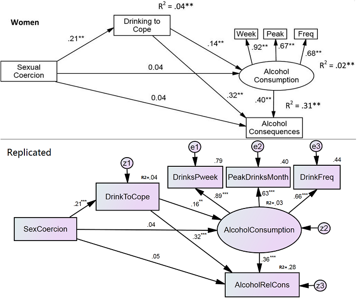

*Review & Test Published SEM Research*
======================================

Fossos, N., Kaysen, D., Neighbors, C., Lingren, K.P., Hove, M.C. (2011). Coping motives as a mediator of the relationship between sexual coercion and problem drinking in college students. *Addictive Behaviors, 36*, 1001-1007.

Background
================

This research was carried out on a first year student population at an American college campus in a Midwestern state. Prior research has demonstrated that student populations have higher base rates for:

1.  Alcohol consumption,
2.  Alcohol-Related negative Consequences (ARCs), and
3.  Sexually Coercive experiences (SC).

Prior research also demonstrated that alcohol consumption increases the risk of sexual victimisation, and that sexual victimisation increases alcohol consumption (i.e. a reciprocal association). This study aimed to build on these theories by testing for a similar association between alcohol and Sexual Coercion (SC). It also aimed to study the latent mechanisms of the relationship and whether those mechanisms differ across sex.

The literature focuses on sexual victimization (e.g. sexual assault, rape). In contrast, SC refers to "behaviors in which nonphysical tactics (e.g., verbal pressure, lying, deceit, and continual arguments) are utilized to obtain sexual contact with an unwilling [partner]". The distinction is important, because although females are significantly more likely to suffer sexual victimisation than males, both males and females self-report approximately equal rates of SC in their voluntary intimate relationships. The study of SC is justified because it is a risk factor for psychological distress and is associated with decreases in condom use and increases in sexually transmitted diseases, physical aggression/victimization and poor psychological/physical health.

The current theory explaining the relationship between alcohol and sex victimization is the 'self-medication hypothesis'. Under this theory an individual perceives alcohol as a tool for altering mood states. Of all possible motivations for drinking, the motivation in this context is the reduction of distress. The literature mostly applies this to sex victimisation, where the individual consumes alcohol to cope with distress caused by the victimisation. The study under review attempted to test whether the self-medication hypothesis extends to SC. Their model hypothesises that using alcohol to cope ('DrinkToCope') would mediate the relationship between SC and consumption, and the relationship between SC and ARCs (i.e. significant total effects through the DrinkToCope mediator).

Research Objectives
===================

The main objective was to determine whether self-medicating behaviour (i.e. a coping motive) mediates the relationship between SC and alcohol consumption and/or ARCs. If an individual uses alcohol to cope with distress, to what extent does DrinkToCope behaviour mediate the link between SC and alcohol consumption? To what extent does it mediate the link between SC and ARCs? Are direct effects from SC to consumption/ARCs completely or partially mediated? Understanding these mechanisms will aid in minimising the damage caused by SC.

Data Description
================

Data were collected in two stages. First, by paying `$10` to incoming college students from a Northwestern campus in America to complete an Internet survey. There was a 51.1% response rate of the 4103 students invited to participate. Second, a total of 780 students were retained from this sample (Males, *n*=333; Females, *n*=447; Mean age=18.18, *SD*=0.42) who met the entry criteria of being over 18 and having at least one heavy drinking episode in the past month (i.e. Females, 4`<`drinks; Males, 5`<`drinks). These second round participants were paid `$25` to complete a 50-minute online assessment for the study.

**Measurements:**

-   *'SC'*: Revised Conflict Tactics Scale (shortened; 2004). "My partner insisted on sex when I did not want to or insisted on sex without a condom" etc.) Likert scale reduced to a binary factor (Yes/No).
-   *'DrinkToCope'*: Five Item Drinking Motives Questionnaire (1994). "How often would you say that you drink for each of the following reasons: To forget about your problems? Because it helps you when you feel depressed or nervous?" etc.)
-   *'Consumption'*: Daily Drinking Questionnaire (1985). "How much alcohol, on average (measured in number of drinks), do you drink on each day of a typical week?" etc.) Three frequency subscales.
-   *'ARCs'* (Alcohol Related Consequences): Rutgers Alcohol Problem Index (1989). "How many times in the previous three months because of alcohol have you: Neglected your responsibilities?" etc.)

Results
=======

There was no significant difference between males (16.11%) and females (19.00%) who experienced SC, and no significant difference in DrinkToCope scores. Males scored significantly higher on consumption and ARCs. All correlations were positive. For males, SC correlated significantly with all variables except drinking frequency (a sub-scale of Consumption), whereas for females, SC correlated with DrinkToCope and ARCs but not consumption. For both females and males all variables correlated significantly with ARCs.

The whole sample SEM and male-only SEM were similar. The whole sample supported direct associations between SC and: 1. DrinkToCope, 2. ARCs, and 3. Consumption (at the *p*`<`.1 level only). The DrinkToCope mediation path was significant, but mediation was only partial because of the significant direct paths. The male-only SEM supported all whole sample direct associations except the direct path from DrinkToCope to Consumption. The DrinkToCope mediation path was significant, but as with the whole sample the mediation was only partial due to significant direct paths from SC to Consumption and ARCs.

The female-only SEM differed from the male and whole sample model. It did not support the direct path associations from SC to any variable other than DrinkToCope. It did support an indirect mediation path from SC to ARCs mediated by DrinkToCope. With no significant direct effects the result supported full mediation between SC and ARCs by DrinkToCope. The indirect effects were significant from SC to Consumption but the full mediation path was not significant.

Model Improvements
==================

Replicating Path Diagram
------------------------

The necessary correlations were available for male and female models. The female model was chosen for replication. The model was replicated with similar estimates and path significance, although many to a higher level (*p*`<`.001 level), with lower residuals and df, *X*2(6)=14.195, *p*=0.28. The improvement was reflected in higher GFI (.958 to .990) and CFI (.923 to .985), and lower RMSEA (.077 to .055).

Modification Indices & Residual Covariances
-------------------------------------------

The model fit so well that modification indices only suggested covariances between the residuals for ARCs and two other residuals for Consumption subscales (Drink per Week; MI=5.267, PC=-4.136 and Drink Frequency; MI=6.864, PC=1.109). There was a high residual covariance between ARCs and Drink Frequency. Adding a covariance between the residuals reduced Chi-square the most, reaching non-significance, *X*2(5)=2.471, *p*=0.78, and reduced all standardised residuals to below an absolute value of 1. A Chi-square test was carried out (*X*2b-*X*2a=14.195-2.471=11.724) and the model was a significant improvement, *X*2(5)=11.724, *p*=0.001, with the residual covariance added. In spite of this the original model would be retained because the authors do not articulate a theoretical foundation for the residual covariance. Moreover, the replicated model fit well enough that adding additional spurious paths to improve fit would be unnecessary and bad practice.

Conclusions
===========

The study made two additions to the literature. First, the results rejected the null hypothesis that DrinkToCope behaviour does not at least partially mediate the association between SC to Consumption or SRCs. Partial mediation was supported in the male and whole sample. Second, it showed that for females the association from SC to ARCs is fully mediated by DrinkToCope behaviour, unlike the male or whole sample that only support partial mediation. Therefore, the extent to which females self-medicate with alcohol influences the association between SC and ARCs, whereas for males the association exists without DrinkToCope behaviour. The study authors note that this has treatment applications in terms of reducing ARCs for females distressed by SC.

The study should be criticised for the interpretation of the direct link between SC and Consumption for males. The authors only found a marginal p-value of .06, noted that it was marginal, then discussed it with other highly significant paths as if they were all at parity. Further to this point there were dozens of hypothesis tests in the study, not counting the SEMs, and not mention of bonferroni correction or increased likelihood of type I errors. As a methodological criticism, values and behaviours relating to alcohol and sex differ significantly across the United States. Although the researchers qualified that they used Northwestern college students, they should also have noted that the research may not be generalisable outside of the state. Similarly, with the sample was composed almost entirely 18 year olds on their first year of college. This would not be an unstable period in their lives and any number of unidentified systematic variables could be acting on the population that were not addressed or mentioned in the study. In defence of the paper, the authors do qualify that this is the first time the relationship has been studied and that longitudinal research with broader populations will be upcoming.

*Figure 1.* Replicated Path Diagram
