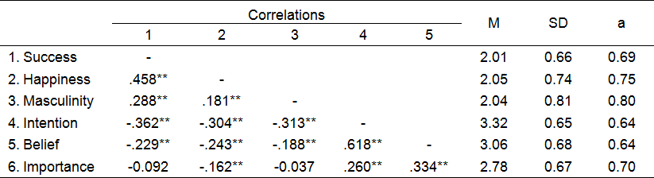
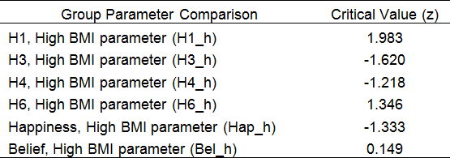

*Perceived Importance of Health Behaviours: Relationship to Materialism, Masculinity, Health Attitudes and BMI.*
================================================================================================================

Core reference:

Wang, W.C., Worsley, A., Cunningham, E.G. (2008). Social ideological influences on reported food consumption and BMI. *International Journal of Behavioral Nutrition and Physical Activity, 5*, 1-20.


1.0 Introduction
================

1.1 Background
--------------

There is a relationship between the personal values of 'Materialism' and 'Masculinity' (Vitell, Nwachukwu, Barnes, 1993). 'Materialism' is the "importance a consumer attaches to worldly possessions" (Belk, 1985), a tendency to believe that consumption of goods and services is one of the greatest sources of satisfaction and dissatisfaction in life. 'Masculinity' is "the extent to which individuals in a society expect men... to be assertive, ambitious, competitive, to strive for material success, and to respect whatever is big, strong and fast" (Vitell et al., 1993). There is a positive association between these attitudes.

Both 'Masculinity' (Vitell, 1993; Sieverding, 2002) and 'Materialism' (Williams, Hedberg, Cox, Deci, 2000) are associated with less frequent health promoting activities and more frequent risk-taking activities. In other words, high levels on either value may be associated with decreased perceived 'Importance of Health Behaviours'.

'Health Attitudes' are the extent an individual feels they can influence their health outcomes and are related to health behaviours. The relationship between 'Importance of Health Behaviour' and the two values of 'Masculinity' and 'Materialism' may not be independent of an individual's overriding 'Health Attitudes'. That is, the extent to which an individual believes their actions influence their health may mediate the relationship between the two values and perceived 'Importance of Health Behaviours'.

A high Body Mass Index (BMI) can be indicative of poor health decisions and unhealthy lifestyle (e.g. high fat/energy diet with insufficient exercise causing high BMI). The above variable relationships and mediation mechanisms may be different for 'unhealthy' high BMI groups as opposed to 'healthy' low BMI groups.

1.2 Aim
-------

One aim of this report was to investigate the relationships between the variables 'Materialism', 'Masculinity' and 'Importance of Health Behaviours' (aka. 'Importance'). Another aim was to identify the mediating influence of 'Health Attitudes' and whether the processes identified differed based on BMI.

1.3 Hypotheses
--------------

The study consisted of six path hypotheses, a mediation relationship and a group comparison. These were summarised below (Table 1).

Table 1. *Hypotheses*


Structural Equation Modelling was used to test the hypotheses that were summarised above in Table 1. The first five hypotheses (i.e. H1 to H5) were single paths between latent variables that represented the main conceptual relationships outlined in the literature. Specifically, that higher 'Materialism' or 'Masculinity' are associated with lower 'Health Attitudes', and that all three are associated with lower 'Importance of Health Behaviours'. The sixth hypothesis was between the two independent variables. This was a covariance (i.e. "**\<--\>**") because no path direction was identified in the literature. The two mediation hypotheses (i.e. "Med 1", "Med 3") assessed the mediating influence of 'Health Attitudes'. Finally, the BMI group hypotheses assessed whether there were parameter differences for the paths between low and high BMI groups.


2.0 Conceptual Model & Mediation Hypotheses
==========================================

2.1 Full Model
--------------

To visualise the full conceptual and hypothesis model a path diagram was specified in AMOS. The independent variable 'Materialism' was a latent variable composed of two observed variables, 'Success' and 'Happiness'. Each of these observed variables had a *delta* error term (i.e. 'd1', 'd2') attached. The dependent variable 'Health Attitudes' was also a latent variable composed of two observed variables, 'Intention' and 'Belief'. Each of these observed variables had *epsilon* error terms (i.e. 'e1', 'e2') attached, in addition to the *zeta* error term (i.e. 'z1') attached to the latent 'Health Attitudes' dependent variable. Finally, the single measures 'Masculinity' and 'Importance' were plotted as observed variables, with a *zeta* error term (i.e. 'z2') attached to the dependent variable 'Importance'. The appropriate direct paths for hypotheses H1 through H5 were drawn in along with the covariance path for H6. The completed path diagram was presented below (Figure 1).


*Figure 1.* Conceptual Path Diagram

2.2 Mediation Hypothesis
------------------------

The single mediator variable was 'Health Attitudes'. It acted as both a dependent endogenous variable predicted by 'Materialism' (H1) and 'Masculinity' (H4) and as an independent exogenous variable predicting 'Importance' (H3). The mediation hypotheses specified in Table 1 referred to: A. The non-significance of the direct paths from 'Materialism' or 'Masculinity' to 'Importance', and; B. The significance of indirect paths via 'Health Attitudes'. The independent variables would significantly predict 'Importance' via 'Health Attitudes', and paths H1, H4 and H3 would significantly contribute to the model while direct paths, H2 and H5, would not. All paths being significant would indicate partial mediation.

2.3 Median Split BMI Comparisons
--------------------------------

A final model was identified with the whole sample and refined until no further alterations could improve model fit. The sample was median split by BMI (e.g. High BMI, Low BMI) and the two groups were compared for parameter differences to determine whether the relationships identified in the whole sample model were different across groups. Model parameters for the two groups were compared via critical values. This analysis was supplemented by broader review of the significance of specific paths.


3.0 Methodology
==============

3.1 Population & Sample
-----------------------

The population of interest was Australians between the ages 55 and 70. The base sample consisted of 259 participants and the revised sample after outlier removal consisted of 252 participants (see section 4.2).

3.2 Materials
-------------

The independent variable 'Materialism' was measured with two items. The first item was 'Success' and it measured the extent individuals value traditionally high-cost goods (e.g. luxury cars). The second item was 'Happiness' and it measured how much individuals assume their lives would improve if they owned more of these goods (e.g. would they be happier if they owned luxury cars). The independent variable 'Masculinity' was measured with one item. It assessed the extent an individual maintains a 'Masculine' world view as outlined according to the above definition (see section 1.1). Higher scores on either measure indicate higher levels of 'Materialism' and 'Masculinity'.

The mixed variable (i.e. independent and dependent variable roles) 'Health Attitudes' were measured with two items. The first item was 'Intention' and it measured whether individual intended to take action to ensure a positive health status (e.g. diet and exercise). The second item was 'Belief' and it measured how much an individual believes they can control their own health circumstances (e.g. ability to manage own health). Higher scores indicate greater perceived control over health outcomes.

The dependent variable 'Importance of Health Behaviour' was measured with one item. It assessed the perceived priority an individual places on pro-health behaviours (e.g. is healthy diet important to you?). Higher scores indicate greater concern for pro-health behaviours. Scale reliability was assessed during the analysis (see section 4.1).

BMI is a ratio of weight to height. It is an inexpensive and fast means of estimating unhealthy lifestyle by indirectly estimating body fat levels. For the purposes of this study (i.e. low vs. high, healthy vs. unhealthy BMI) the measure will have a degree of mischaracterisation error. Very muscular but healthy people can have inflated 'unhealthy' BMIs, and unhealthily thin people can have low 'healthy' BMIs. Nevertheless, the measure is widely accepted by multinational NGOs (e.g. World Health Organisation) and the degree of error should be no greater for other measures used. The high BMI group had scores above the median sample value and the low BMI group had scores equal to or below the median.


4.0 Results
==========

4.1 Descriptive Statistics & Correlations
-----------------------------------------

Exploratory correlations and descriptive statistics were calculated and summarised below (Table 2).

Table 2. *Scale Correlations, Descriptives, Cronbach's a;* \*\* *p\<.01, N=259*



There were not extreme values for Means or Standard Deviations. All scales attained the minimum Cronbach's *a* reliability of .60.

There were two non-significant correlations for 'Importance', one with a 'Materialism' scale (i.e. 'Success'), the other with 'Masculinity'. This lack of relationship contrasted with the expectation outlined in the literature and suggested that the H2 or H5 direct paths may not be significant in subsequent SEM analysis. All other correlations were significant to the *p*\<.01 level and in the correct directions specified in the literature.

4.2 Outlier Removal & Normality Assessment
------------------------------------------

To identify multivariate outliers in the dataset Mahalanobis squared distances were calculated for all cases. This procedure assigns a squared interpoint distance statistics to each case in the dataset representing the distance between that case and the multivariate centroid of the other cases.

The Mahalanobis distances identified that seven cases diverged from an otherwise linear distribution of distances. All these cases had distance values greater than 14. The divergence of these values from the multivariate centroid will distort the model fit and were removed (see Appendix A for SPSS outlier removal syntax).

Normality statistics were calculated measuring the skew, kurtosis and multivariate normality for the observed variables. These were presented below (Table 3).

Table 3. *Normality Assessment (N=259)*


As shown in Table 3 above, the positive skew for the variables 'Masculinity' and 'Success' exceeded the critical ratio of 2, as did the negative skew of 'Intention'. In terms of kurtosis, the variables 'Belief' and 'Happiness' were significantly platykurtic (i.e. c.r.\>|2|). Finally, the magnitude of joint multivariate kurtosis (i.e. multivariate non-normality) was not significant (i.e. |-1.733|\<2).

This meant that the observed variables did not diverge from normality enough to influence the estimates produced via maximum likelihood estimation (MLE). This was further supported by review of the Bollen-Stine bootstrap p-value (*p*=.017) and the bootstrap distribution mean (*x-bar*=4.769, *n*=2000), which were very similar to the MLE p-value (*p*=.013) and the model degrees of freedom respectively (*df*=5). As one final measure, the parameter estimates of the model were bootstrapped to compare the MLE parameters to the bootstrapped ones. The largest estimation bias by magnitude was for the H3 path ('Health Attitudes' to 'Importance') and was no greater than 0.021, indicating that non-normality of the data has not significantly distorted MLE parameters.

4.3 Starting Model
------------------

Estimates were calculated for the first model (Figure 1) with the original dataset. The data cleared of outliers was used with later hypothesis testing (see section 4.5). This structure was unavoidable as the order which each statistical procedure was to be carried out was predetermined in this manner.

The overall fit was assessed using the Bollen-Stine corrected p-value, in addition to the value produce by maximum likelihood estimation, to ensure joint multivariate non-normality did not distort results. The overall model fit Chi-Square statistic was significant, *X*<sup>2</sup>(5, *N*=259)=12.609, *p*=.027, meaning that the whole model was not a good fit. This result was supported by the Bollen-Stine corrected p-value, which was only slightly larger (*p*=.032) despite accounting for non-normality. It is possible that the Chi-Square is elevated by the moderate sample size and the complexity of the model (i.e. many small misfits summing to a larger misfit). Other statistics were assessed to ensure a comprehensive assessment of model fit.

For the measurement part of the model the squared multiple correlations (SMC) were acceptable with SMCs for unfixed manifests ranging from .374 ('Happiness') to .746 ('Intention'). This was expected given that the scales were independently verified to have Cronbach's *a* values above 0.6 for all scales. For the structural part of the model, the SMCs for the two dependent variables were .315 for 'Health Attitudes' (i.e. model explains 31.5% of 'Health Attitudes' variance) and .126 for 'Importance of Health Behaviours' (i.e. model explains 12.6% of variance). The SMC of 'Importance of Health Behaviours' was low but this is an acceptable level of variance explained in humanities research.

All regression paths were significant to at least the *p*\<.05 level except for H2 (*p*=.976) and H5 (*p*=.181). These are the two *gamma* regression paths leading to 'Importance of Health Behaviours', the first from 'Materialism' (H2, *gamma*21: *xi*1-\>*eta*2) and the second from 'Masculinity' (H5, *gamma*22: *xi*2-\>*eta*2). These paths indicate where the model fit could be improved in later re-specification and closer study was carried out during hypothesis testing.

All standardised residual covariances were less in magnitude than the critical value 1.96. The highest was between 'Importance' and 'Belief' (*theta*<sub>*delta*</sub>=1.363), and the second highest was between 'Importance' and 'Happiness' (*theta*<sub>*delta*</sub>=-.936). Although no values were critical the higher residuals may indicate where the model could be improved.

The fit statistics showed mixed results in terms of model fit. The Normed Chi-Square (*X*<sup>2</sup>/df=12.609/5=2.522) was outside the 1 to 2 range, the Root Mean-Square Error of Approximation (RMSEA=.077) was greater than .05, and the Adjusted Goodness-of-Fit Index (AGFI=.931) and Tucker-Lewis Index (TLI=.920) where less than .95, indicating poor fit. However, the Root Mean-square Residual (RMR=.016) and Standardised RMR (SRMR=.033) were less than .06, and the unadjusted Goodness-of-Fit Index (GFI=.984) and Comparative Fit Index (CFI=.973) where greater than .95, indicating good fit.

Finally, the PCLOSE hypothesis test (PCLOSE=.167) was not significant to the p\<.05 level. This result provided a useful summary to explain the mixed fit statistics: Although the model was a 'close fit' (i.e. PCLOSE\>0.05 = RMSEA\<0.05), it was not an 'exact fit' (i.e. RMSEA=0).

4.4 Munck Error Incorporation Model
-----------------------------------

Before formal hypothesis testing, the starting path model (Figure 1) was re-specified to incorporate the measurement error of the variables 'Masculinity' and 'Importance of Health Behaviours'. This is Munck's method of incorporating measurement error. This process uses the Cronbach's *a* (i.e. reliability) and Standard Deviation (SD) of each scale to fix the scale loading and error variance. This was only carried out for the single scale measures as the latent variables already take error variances into account.

The Cronbach's *a* and SD for 'Masculinity' (*a*=0.8, *s*=0.81) and 'Importance of Health Behaviours' (*a*=0.7, *s*=0.67) were provided by a previous study. These were used in Munck's formulas to calculate the loading coefficients and error variances for the two variables. For 'Masculinity', the loading coefficient was 0.7245 (*s* \* sqrt[*a*]=0.81 \* sqrt[0.8]), with an error variance of 0.1312 (*s*<sup>2</sup> \* [1-*a*]=0.656 \* 0.2). For 'Importance of Health Behaviours', the composite scale regression coefficient was 0.5606 (*s* \* sqrt[*a*]=0.67 \* sqrt[0.7]), with an error variance of 0.1347 (*s*<sup>2</sup> \* [1-*a*]=0.4489\*0.3).

In order to incorporate these fixed loadings and error variances the model was respecified and the updated model was presented below (Figure 2).


*Figure 2.* Munck's Method of Incorporating Measurement Error

The figure above demonstrated how it was necessary to modify the model path structure in order to incorporate measurement error as per Munck's Method.

4.5 Path Hypothesis Testing & Model Re-Specification
----------------------------------------------------

The first stage of testing the six hypotheses was to analyse the significance of each hypothesis path. The second stage was to analyse whether the model was improved by removing any paths. This was carried out through comparisons between the unconstrained model (i.e. all hypothesis paths free) and six alternate models with each hypothesis path removed (i.e. fixed to zero). The statistics used to make the comparisons consisted of Chi-Square tests along with information-theoretic measures, including the Akaike Information Criterion (AIC), Consistent Akaike Information Criterion (CAIC), Browne-Cudeck Criterion (BCC) and the Bayes Information Criterion (BIC).

For the first stage of hypothesis testing the model paths were assessed for significance. The results were presented below (Table 4).

Table 4. *Hypothesis Path Analysis;* \*\*\* *p\<.001*


As shown in Table 4, the paths for hypotheses one, four, three and six were all significant to at least the *p*\<.05 level, with parameter estimates in the hypothesised positive/negative directions (i.e. H1: Higher 'Materialism' leads to lower 'Health Attitudes', etc). The path for hypothesis two, that those with high materialists values would have lower perceived importance of health behaviour, was not significant (H2: *beta*=0.199, *t*=0.442, *p*=.659). Also, the path for hypothesis five, that those with high masculine values would have lower perceived importance of health behaviour, was not significant (H5: *beta*=0.128, *t*=1.279, *p*=.201). These two non-significant hypothesis paths indicated model improvements in the next stage of hypothesis testing.

The second stage of hypothesis testing was to analyse whether the model was improved by removing any hypothesis paths. The results were presented below (Table 5).

Table 5. *Chi-Square Comparisons to Unconstrained model*


Seven models were included in Table 5 above. The first was the unconstrained model as depicted in Figure 2 with all paths free to be estimated. Each subsequent model (e.g. H1=0, H2=0, etc.) was used to test how the overall model fit was effected by fixing specified hypothesis paths to zero. The Chi-Square (i.e. 'CMIN') and p-values demonstrated whether each model was statistically different from the unconstrained model, and the information-theoretic measures (AIC, CAIC, BCC, BIC) integrated an assessment of model parsimony into the hypothesis testing.

The two hypothesis paths that were not significant in Table 2, H2 and H5, were significant in Table 3. This meant that when those paths were individually removed from the model it did not significantly increase the exact model fit Chi-Square statistic (H2: *X*<sup>2</sup>(1)=0.185, *p*=0.667; H5: *X*<sup>2</sup>(1)=1.165, *p*=0.202). Moreover, all four information-theoretic measures were lower for H2=0 and H5=0 than the unconstrained model.

Based on the information contained in Table 4 and 5 above, the regression path H2 is not significant and contributes the least to the model fit. The hypothesis that people who hold higher materialist values have lower perceived importance of health behaviours was not supported by the model. The path was removed and the assessment process was started again.

After removing the H2 path there were no notable changes to the parameter estimates, with the exception that the significance of all paths increased. The H5 path, which was not significant in the original model (see Table 4 above), was still not significant. As before, this non-significant hypothesis path indicated a potential model improvement for the next stage of hypothesis testing. Model comparisons were carried out for the new model without the path for hypothesis two and the results were presented below (Table 6).

Table 6. *Chi-Square Comparisons to Unconstrained (H2=0) model*


Six models were included in Table 6 above. These were the same models as previously tested except that in these comparisons the unconstrained model did not include the hypothesis two path. In this table, H5 was the only path removed that did not significantly increase the exact model fit Chi-Square statistic (H5: *X*<sup>2</sup>(1)=2.287, *p*=0.130). This was the only path remaining with a non-significant parameter estimate (see Table 4) and the four information-theoretic measures were either lower or similar by fixing it to zero.

Based on the updated path estimate significance values and the information contained in Table 6 above, the regression path H5 is not significant and contributes the least to the model fit. The hypothesis that people who held higher masculine values have lower perceived importance of health behaviours was not supported by the model. The path was removed and the assessment process was started again.

Following the removal of the H5 path all remaining paths of the unconstrained model were significant at the *p*\<.05 level. In model comparisons against the new unconstrained model (i.e. without H2 or H5), fixing H5 to zero was only borderline non-significant (H5: *X*<sup>2</sup>(1)=3.761, *p*=0.052), and only improved the model according to the two adjusted information-theoretic measures, BIC and CAIC. Given that the estimated path for this hypothesis was still significant it was left in the model. This was the weakest path remaining so no additional paths were removed. The final parameter estimates were presented below (Table 7).

Table 7. *Hypothesis Path Analysis;* \*\*\* *p\<.001*


As shown above in Table 7 all remaining hypothesis paths were statistically significant to the *p*\<.05 level. In terms of the whole model, although it was not an 'exact' fit, *X*<sup>2</sup>(7, *N*=252)=16.883, *p*=.018, it was a 'close' fit (PCLOSE=0.157) with no significant standardised residual covariances (i.e. exceeding an absolute value of 2). Model fit statistics were discussed in detail below in section 4.7, Final Model Fit Assessment.

One final issue when finalising the model was a suggestion from the modification indices. The model fit could have been improved by covarying the *epsilon* error term for the observed variable 'Belief" (*epsilon*2) with either the *zeta* error term for 'Importance of Health Behaviours' (*zeta*2) or the error term for the associated observed variable (*epsilon*3). The significance of this path did not originate from the observed variable 'Belief' but rather from the observed variable 'Intention'. The high Squared Multiple Correlation (SMC) of 'Intention' (SMC=.853) compared to 'Belief' (SMC=.489) meant that the latent factor had greater communality with the former variable than with the latter. Subsequently there remains predictive power within the *epsilon*2 residuals that correlates uniquely with the unpredicted residual components (*zeta*2) of the 'Importance' latent variable construct. The two variables, 'Intention' and 'Belief', were potentially measuring and predicting multiple constructs.

The model was left unchanged for three reasons. Firstly, simply adding the covariance lacked any theoretical foundation at that time (i.e. the 'other' variables being measured were unknown and unstudied). Secondly, the latent variable 'Health Attitudes' is only measured by the two observed variables 'Belief' and 'Intention', and removing either would have redefined the construct thereby rendering all current hypotheses inappropriate and requiring a new literature review and reformulation. Finally, the model was already an acceptable or 'close' fit with exclusively significant paths, and therefore did not required additional path optimisation.

4.6 Mediation Hypothesis Testing & Total Effects
------------------------------------------------

The necessary changes were made to the model and the final model was presented below (Figure 3).


*Figure 3.* Final Model (all paths sig. *p*\<.05)

All three variables had paths to 'Importance of Health Behaviour', either direct (i.e. 'Health Attitudes') or indirect (i.e. 'Materialism', 'Masculinity'). The standardised weights and total standardised effect sizes were used to determine the relative importance of each variable in predicting 'Importance of Health Behaviour'.

The only variable that had any direct effect was 'Health Attitudes' via the hypothesis three path (H3). This effect was .390, meaning that for each standard deviation increase in 'Health Attitudes' the 'Importance' variable increases by 0.390 standard deviations. In this case the standardised direct effect and regression weight should be and were identical. As this direct effect was within the range of 0.3 to 0.5 it was considered a moderately strong effect.

The other two variables, 'Materialism' and 'Masculinity', had indirect effects through 'Health Attitudes'. The total effect of 'Materialism' was -0.187, meaning that for each standard deviation increase in 'Materialism' the 'Importance' variable decreases by 0.390 standard deviations ('Materialism' to 'Health Attitudes' = -0.480; 'Health Attitudes' to 'Importance' = 0.390; -0.480 \* 0.390 = -0.187 standardised total effect). The total effect of 'Masculinity' was -0.071, meaning that for each standard deviation increase in 'Masculinity' the 'Importance' variable decreases by 0.071 standard deviations ('Masculinity'' to 'Health Attitudes' = -0.181; 'Health Attitudes' to 'Importance' = 0.390; -0.181 \* 0.390 = -0.071 standardised total effect). Therefore, based on these total effects the strongest predictor of the 'Importance of Health Behaviour' variable were, in descending order of predictive power, 'Health Attitudes' (.390), 'Materialism' (-0.187), and 'Masculinity' (-0.071).

The hypothesis testing and path re-specification process effectively tested all possible mediation relationships. These were between the dependent variable 'Importance of Health Behaviours' and the two other independent variables, 'Materialism' (paths H1 and H2) and 'Masculinity' (paths H4 and H5). The mediator was 'Health Attitudes'. The model fit was assessed to determine which paths could be fixed to zero without significantly impairing the model. To confirm prior analysis the results for this specific mediation assessment were presented below (Table 8).

Table 8. *Chi-Square Comparisons for Mediation Paths*


The 'Unconstrained' model was identical to the Figure 2 path diagram with H2 and H5 free to be estimated. Under this model partial mediation is available for both 'Materialism' and 'Masculinity'. As was determined in prior analysis, removing paths H1 and H4 significantly increased the Chi-Square exact fit statistics (i.e. poorer fit), supporting the conclusion that a mediation relationship exists (i.e. the model is a better fit with the paths than without). Moreover, removing paths H2 and H5 did not significantly increase Chi-Square statistics, supporting the conclusions that the relationship between 'Materialism' and 'Masculinity' was mediated through 'Health Attitudes'.

Therefore the relationship between 'Materialism' and 'Importance' was not direct by rather mediated by 'Health Attitudes'. As the standardised total effect was -0.187 and direct effects were not significant, the extent to which increasing 'Materialism' is associated with decreasing 'Importance' is contingent on 'Health Attitudes'. Similarly with 'Masculinity', as the standardised total effect was -0.071 and direct effect were not significant, the extent to which increasing 'Masculinity' is associated with decreasing 'Importance' is also contingent on 'Health Attitudes'.

4.7 Final Model Fit Assessment
------------------------------

The final model goodness of fit statistics and R-Square values for the model as depicted in Figure 3 were analysed. The model fit Chi-Square statistics was significant, *X*<sup>2</sup>(7, *N*=252)=16.883, *p*=.018, and had a similar Bollen-Stine corrected p-value (*p*=.024). This meant that the whole model was not an exact fit even if non-normality was accounted for. All regression paths were significant to at least the *p*\<.05 level. All standardised residual covariances were less in magnitude than the critical value 1.96. The highest was between 'Importance' and 'Belief' (*theta*<sub>*delta*</sub>=1.748), and the second highest was between 'Importance' and 'Masculinity' (*theta*<sub>*delta*</sub>=1.247).

The fit statistics showed mixed results in terms of model fit. The Normed Chi-Square (*X*<sup>2</sup>/df=16.883/7=2.412) was outside the 1 to 2 range, the Root Mean-Square Error of Approximation (RMSEA=.075) was greater than .05, and the Adjusted Goodness-of-Fit Index (AGFI=.928) and Tucker-Lewis Index (TLI=.930) where less than .95, indicating poor fit. However, the Root Mean-square Residual (RMR=.020) and Standardised RMR (SRMR=.042) were less than .06, and the unadjusted Goodness-of-Fit Index (GFI=.976) and Comparative Fit Index (CFI=.967) where greater than .95, indicating good fit. Finally, the PCLOSE hypothesis test (PCLOSE=.157) was not significant to the *p*\<.05 level. This result summarised the mixed fit statistics: Although the model was a 'close fit' (i.e. PCLOSE\>0.05 = RMSEA\<0.05), it was not an 'exact fit' (i.e. RMSEA=0).

The SMCs for the unfixed manifest variables ranged from .312 ('Happiness') to .853 ('Intention'), which represented acceptable levels of reliability for these variables. In terms of R-Square values, the SMCs for the two dependent variables were .341 for 'Health Attitudes' and .126 for 'Importance of Health Behaviours'. This meant that the variation in 'Materialism' and 'Masculinity' explained 34.1% of the variation in 'Health Attitudes' scores, and the variation in all three of those variables explained 12.6% of the variation in 'Importance of Health Behaviours'.

4.8 Median Split BMI Comparisons
--------------------------------

The variable BMI was median split into high and low BMI groups (above median *n*<sub>1</sub>=125, less than or equal to median *n*<sub>2</sub>=127) and all relevant parameters were compared with pairwise parameter comparisons. The model comparison was summarised below (Figure 4).


*Figure 4.* Parameter Comparisons (Postfixes: Low BMI="*l", High BMI= "*h")

There were six parameter comparisons in total. The low BMI solution was not admissible due to a negative error variance for *epsilon*1 (-0.012). That specific error variance was constrained to be equal for both high and low BMI groups so admissible parameter comparisons could be calculated. This approach was superior to fixing 1 to an absolute value (i.e. zero, a previous error value, etc.) because it allowed the model to incorporate at least some level of unique variance for the separate groups as opposed none. The results of the pairwise comparisons were presented below (Table 9).

Table 9. *Parameter Comparisons (n1=125, n2=127, N=252)*



In pairwise parameter comparisons the Critical Values are based on a standard normal distribution (i.e. significance = CV\>|1.96|). This meant that the only significant parameter difference between groups was for the H1 regression path between 'Materialism' and 'Health Attitudes'. For the low BMI group, the H1 standardised loading was –0.310 (*p*=.032) while for the high BMI group, the same path loading was -0.606 (*p*=.032). This suggested that the negative relationship between 'Materialism' and 'Health Attitudes' was stronger for people with higher BMI.

There were two other group differences not identified by the pairwise comparisons. Firstly, the H3 path between 'Health Attitudes' and 'Importance' was borderline significant (*p*=.06) for the low BMI group with a small standardised loading (.219), while it was highly significant (*p*\<.01) for the high BMI group with a moderate standardised loading (.544). This suggested that the positive 'Health Attitudes' to 'Importance' relationship was weaker for lower BMIs. The other group difference was the H4 path between 'Masculinity' and 'Health Attitudes'. The path was highly significant (*p*\<.01) with a moderate standardised loading (-.337) for the low BMI group and not significant (*p*=.729) with a very weak standardised (-.046) loading for the high BMI group. This suggested that the negative 'Masculinity' to 'Health Attitudes' relationship was stronger for lower BMIs.


5.0 Conclusion
==============

'Materialism' and 'Masculinity' did have a negative relationship with 'Importance'. However, this relationship was fully mediated by 'Health Attitudes', which had a moderate positive relationship with 'Importance'. 'Materialism' was a better predictor of 'Importance' than 'Masculinity', which was a very weak predictor and 'Health Attitudes' was the strongest 'Importance' predictor. Therefore, most of the apparent association between 'Materialism' or 'Masculinity' and 'Importance' outlined in the literature can in fact be explained by the relationship of those variables have with 'Health Attitudes'. With BMI groups, the negative relationship between 'Materialism' and 'Health Attitudes' was much stronger in the high BMI group, meaning that in overweight populations high 'Materialism' leads to even lower 'Health Attitudes'. Future research should improve the 'Health Attitudes' scales to ensure the relationships found were not distorted by poor testing methods. This may also allow future research to isolate the borderline significant differences found in BMI group comparisons.

References
==========

Belk, R.W. (1985). Materialism: trait aspects of living in the material world. *Journal of Consumer Research, 12*, 265-280.

Sieverding, M. (2002). *Gender and health-related attitudes: The role of a 'macho' self-concept*. Heart disease: Environment, Stress, and Gender. Eds. Weidni G, Kopp MS, Kristenson M.: Amsterdam, IOS Press, 237-250.

Vitell, S.J., Nwachukwu, S.L., Barnes, J.H. (1993). The effects of culture on ethical decision-making: An application of Hofstede's typology. *Journal of Business Ethics, 12*, 753-760.

Wang, W.C., Worsley, A., Cunningham, E.G. (2008). Social ideological influences on reported food consumption and BMI. *International Journal of Behavioral Nutrition and Physical Activity, 5*, 1-20.

Williams, G.C., Hedberg, V.A., Cox, E.M., Deci, E.L. (2000) Extrinsic Life Goals and Health-Risk Behaviors in Adolescents. *Journal of Applied Social Psychology, 30*, 1756-1771.

Appendix A. SPSS Syntax
=======================
``` spss
COMPUTE id=$CASENUM. 
FORMAT id (F8.0).
 EXECUTE.

DATASET ACTIVATE DataSet1.
COMPUTE MD_Outlier=ANY(id, 26, 134, 119, 124, 97, 33, 233).
EXECUTE.

SELECT IF MD_Outlier <>1.
EXECUTE.

FREQUENCIES VARIABLES=BMI
  /FORMAT=NOTABLE
  /STATISTICS=MEDIAN
  /ORDER=ANALYSIS.
EXECUTE.

DATASET ACTIVATE DataSet1.
IF  (BMI>25.680525) BMI_High=1.
IF  (BMI<=25.680525) BMI_High=0.
EXECUTE.
````
